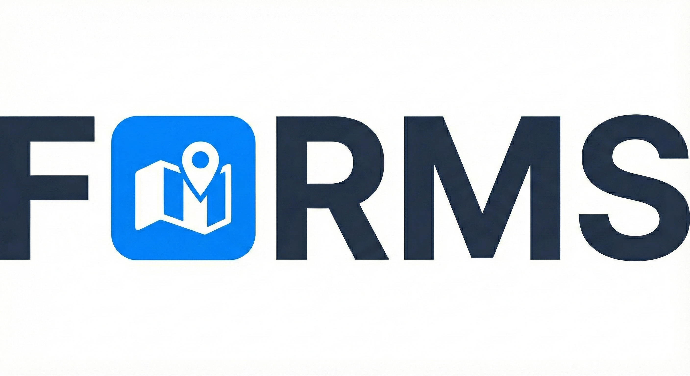
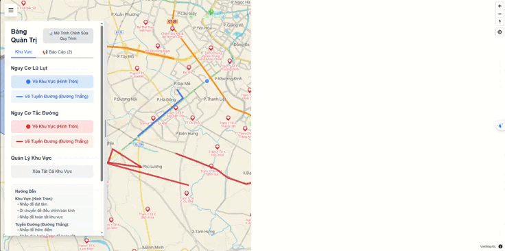

<p align="center">
  
</p>

# Flood and Outage Risk Management System


> **Sản phẩm dự thi Phần mềm Nguồn mở - OLP 2025**
> **Chủ đề:** Phát triển ứng dụng thành phố thông minh dựa trên nền tảng dữ liệu mở.

---

## 📑 Mục lục

<div align="center">

[✨ Tính năng](#tính-năng-chính-features) • [🏗️ Kiến trúc](#kiến-trúc-hệ-thống) • [📦 Cài đặt](#hướng-dẫn-cài-đặt-build-from-source) • [🚀 Chạy ứng dụng](#chạy-ứng-dụng-run) • [📋 Cấu hình](#cấu-hình-môi-trường) • [📄 Giấy phép](#giấy-phép-license) • [👥 Team](#đội-ngũ-phát-triển-team) • [🔗 Liên kết](#liên-kết-hữu-ích-useful-links) • [❓ FAQ](#-faq-câu-hỏi-thường-gặp)

</div>

---

<div align="center">
  
</div>

---

## Tính năng chính (Features)

### Bản đồ thời gian thực

- Hiển thị khu vực ngập lụt và tắc đường trên VietMap
- Cập nhật tức thì qua WebSocket
- Responsive trên mọi thiết bị

### Giám sát cảm biến IoT

- Tích hợp cảm biến mực nước, nhiệt độ, độ ẩm
- MQTT protocol cho communication
- Tự động cảnh báo khi vượt ngưỡng

### AI Computer Vision

- Phát hiện và đếm 8 loại phương tiện (YOLO)
- Giám sát mật độ giao thông real-time
- Cảnh báo tự động khi tắc đường

### Rule Engine - Tự động hóa

- Tạo zones cảnh báo tự động khi cảm biến kích hoạt
- Logic phức tạp với AND/OR operators
- Visual workflow editor (drag-and-drop)

### Crowdsourcing

- Người dùng báo cáo tình trạng ngập/tắc đường
- Phân loại mức độ nghiêm trọng
- Tracking và cập nhật status

### Dự báo thời tiết

- Tích hợp API thời tiết
- Dự đoán rủi ro ngập lụt
- Hiển thị cảnh báo sớm

### Admin Panel

- Quản lý zones, sensors, rules
- Dashboard analytics
- User reports management

---

## Kiến trúc hệ thống

### Tổng quan kiến trúc

Dự án được tổ chức theo mô hình **Microservices** với ba thành phần chính:

```
┌───────────────────────────────────────────────────────────────────┐
│                        CLIENT LAYER                               │
│  ┌──────────────────────────────────────────────────────────┐     │
│  │          Web Dashboard (React 19 + VietMap GL JS)        │     │
│  │    - Interactive Maps | Admin Panel | Workflow Editor    │     │
│  │    - User Reports | Real-time Alerts                     │     │
│  └──────────────────┬───────────────────────────────────────┘     │
└─────────────────────┼─────────────────────────────────────────────┘
                      │ HTTP/WebSocket
┌─────────────────────┼───────────────────────────────────────────┐
│                     ▼                                           │
│  ┌──────────────────────────────────────────────────────────┐   │
│  │        MIDDLEWARE LAYER (Bun WebSocket Server)           │   │
│  │  - Real-time Event Broadcasting                          │   │
│  │  - API Request Proxying                                  │   │
│  └──────────┬────────────────────────┬──────────────────────┘   │
│             │ HTTP                   │ HTTP                     │
└─────────────┼────────────────────────┼───────────────────────┬──┘
              │                        │                       │
              ▼                        ▼                       ▼
    ┌──────────────────┐    ┌──────────────────┐   ┌────────────────────┐
    │   BACKEND (API)  │    │   DATABASE       │   │   BRIDGE/MQTT      │
    │  ┌────────────┐  │    │  ┌────────────┐  │   │  ┌──────────────┐  │
    │  │ Next.js API│  │    │  │  MongoDB   │  │   │  │ Go Bridge    │  │
    │  │ Routes     │  │    │  │  - Sensors │  │   │  │ - MQTT Sub   │  │
    │  │            │  │    │  │  - Rules   │  │   │  │ - API Client │  │
    │  │ • Sensors  │  │    │  │  - Zones   │  │   │  │ - Topic Map  │  │
    │  │ • Rules    │  │    │  │  - Predict │  │   │  └──────┬───────┘  │
    │  │ • Zones    │  │    │  └────────────┘  │   │         │          │
    │  │ • Predict  │  │    │                  │   │         │ MQTT     │
    │  │ • Reports  │  │    │                  │   │         ▼          │
    │  │            │  │    │                  │   │    ┌───────────┐   │
    │  │ Rule Engine│  │    │                  │   │    │MQTT Broker│   │
    │  │ (TS)       │  │    │                  │   │    │(ESP32/IoT)│   │
    │  └────────────┘  │    │                  │   │    └───────────┘   │
    │                  │    │                  │   │                    │
    └──────────────────┘    └──────────────────┘   └────────────────────┘
```

### Thành phần chính

| Module       | Thư mục               | Công nghệ chính                    | Mô tả                                                         |
| :----------- | :-------------------- | :--------------------------------- | :------------------------------------------------------------ |
| **Web App**  | [`/app`](./app)       | Next.js 16, Bun, React 19, VietMap | Giao diện người dùng, Dashboard quản lý, Bản đồ số tương tác. |
| **AI Model** | [`/models`](./models) | Python, YOLOv8/11, OpenCV          | Mô hình nhận diện phương tiện và cảnh báo ngập lụt.           |
| **Bridge**   | [`/bridge`](./bridge) | Go, MQTT Client, API Client        | Middleware MQTT kết nối sensor IoT và Web App.                |

---

## Yêu cầu hệ thống (Prerequisites)

Để cài đặt và biên dịch mã nguồn, máy tính cần cài đặt sẵn:

1.  **Git** (Có hỗ trợ submodule).
2.  **Bun Runtime** (v1.0+): [Cài đặt Bun](https://bun.sh/).
3.  **Python** (v3.9+): Cho module AI.
4.  **Node.js** (v18+) & **npm/yarn** (Tùy chọn).

---

## Hướng dẫn Cài đặt (Build from Source)

### Bước 1: Clone mã nguồn (Quan trọng)

Do dự án sử dụng Git Submodules, bạn **BẮT BUỘC** phải clone với tham số `--recursive` để tải đầy đủ mã nguồn con:

```bash
# Clone toàn bộ dự án
git clone --recursive [https://github.com/PKA-OpenLD/FORMS.git](https://github.com/PKA-OpenLD/FORMS)
```

⚠️ Lưu ý: Nếu bạn đã lỡ clone bằng lệnh thường (thư mục con bị rỗng), hãy chạy lệnh sau để sửa lỗi:

```bash
git submodule update --init --recursive
```

```bash
# Di chuyển vào thư mục dự án
cd FORMS
```

### Bước 2: Cài đặt Web Application (Next.js)

```bash
# Di chuyển vào thư mục app
cd app

# Cài đặt dependencies với Bun
bun install

```

#### Cài đặt .env.local theo .env.local.example

```bash
# linux
cp .env.local.example .env.local
```

```bash
# window
copy .env.local.example .env.local
```

### Bước 3: Cài đặt MQTT Bridge (Go)

```bash
# Di chuyển vào thư mục bridge
cd ../bridge

# Cài đặt dependencies
go mod download

# Tạo file cấu hình
cp config.example.yaml config.yaml

# Chỉnh sửa config.yaml với thông tin MQTT broker và API endpoint
```

### Bước 4: Cài đặt AI Model (Python)

```bash
# Di chuyển vào thư mục models
cd ../models

# Tạo virtual environment (khuyến nghị)
python3 -m venv venv
source venv/bin/activate  # Linux/Mac
# venv\Scripts\activate   # Windows

# Cài đặt dependencies
pip install -r requirements.txt

# Tạo file cấu hình
cp monitor_config.example.yaml monitor_config.yaml

# Chỉnh sửa monitor_config.yaml với camera sources và thông tin cảm biến
```

---

## Chạy ứng dụng (Run)

### Khởi động MongoDB (Required)

```bash
# Sử dụng Docker (Khuyến nghị)
docker run -d -p 27017:27017 --name mongodb mongo:latest

# Hoặc cài đặt MongoDB locally
# https://www.mongodb.com/try/download/community
```

### Khởi động MQTT Broker (Optional - cho IoT sensors)

```bash
# Sử dụng Mosquitto
docker run -d -p 1883:1883 --name mosquitto eclipse-mosquitto:latest
```

### 1. Khởi động Web Application

```bash
cd app

# Development mode
bun run dev

# Production mode
bun run build
bun run start

# WebSocket server (terminal riêng)
bun run server.ts
```

Web app sẽ chạy tại: **http://localhost:3000**

### 2. Khởi động MQTT Bridge (Optional)

```bash
cd bridge

# Development mode
go run .

# Production build
go build -o bridge
./bridge
```

### 3. Khởi động AI Traffic Monitor

```bash
cd models
source venv/bin/activate

# Chạy traffic monitor
python traffic_monitor.py --config monitor_config.yaml

# Hoặc training model mới
python train.py
```

---

## Deployment

### Docker Compose (Khuyến nghị)

```bash
# Build và chạy tất cả services
docker-compose up -d

# Xem logs
docker-compose logs -f

# Dừng services
docker-compose down
```

### Manual Deployment

Xem chi tiết tại:

- [Web App Deployment](./app/README.md#deployment)
- [Bridge Deployment](./bridge/README.md#deployment)
- [AI Model Deployment](./models/README.md#deployment)

---

## Cấu hình môi trường

### Web Application (.env.local)

```env
# MongoDB
MONGODB_URI=mongodb://localhost:27017/flood-management

# VietMap API
VIETMAP_API_KEY=your_vietmap_api_key_here

# WebSocket
NEXT_PUBLIC_WS_URL=ws://localhost:8080

# API Base URL
NEXT_PUBLIC_API_URL=http://localhost:3000/api

# Weather API
WEATHER_API_KEY=your_weather_api_key
```

### MQTT Bridge (config.yaml)

```yaml
api:
  endpoint: "http://localhost:3000/api/sensor-data"
  timeout: 10s

mqtt:
  broker: "mqtt://localhost:1883"
  client_id: "flood-bridge-01"
  qos: 1

topics:
  - mqtt_topic: "sensors/data"
    sensor_id_from_payload: true
```

### AI Model (monitor_config.yaml)

```yaml
api:
  endpoint: "http://localhost:3000/api/sensor-data"
  timeout: 10

locations:
  - id: "sensor-traffic-01"
    name: "Main Intersection"
    coordinates:
      lat: 10.762622
      lon: 106.660172
    density_threshold: 15
```

---

## Giấy phép (License)

Dự án này được phân phối dưới **Apache License 2.0**. Xem file [LICENSE](./LICENSE) để biết thêm chi tiết.

### Các thành phần bên thứ 3:

- **Dataset (AI Model)**: CC BY 4.0 License - [Roboflow Universe](https://universe.roboflow.com/)
- **VietMap GL JS**: Commercial license required for production
- **Other dependencies**: Xem file LICENSE của từng module

---

### Điểm nổi bật:

1. **Microservices Architecture**: 3 module độc lập, dễ scale
2. **Real-time Everything**: WebSocket, MQTT, Live updates
3. **AI-Powered**: YOLO computer vision for traffic monitoring
4. **IoT Ready**: MQTT bridge cho ESP32/Arduino sensors
5. **Visual Tools**: Interactive map, Workflow editor
6. **Automation**: Rule engine tự động tạo zones
7. **Crowdsourcing**: User reports system
8. **Modern Stack**: Next.js 16, React 19, TypeScript, Go, Python

---

## Đội ngũ phát triển (Team)

- **Organization**: PKA-OpenLD
- **Maintainer**: PKA-OpenLD Team
- **Year**: 2025
- **Competition**: OLP 2025 - Phần mềm Nguồn mở

### Liên hệ:

- 📧 Email: [contact@pka-openld.org](mailto:contact@pka-openld.org)
- 🌐 GitHub: [github.com/PMMNM-Dep](https://github.com/PMMNM-Dep)
- 📝 Issues: [GitHub Issues](https://github.com/PMMNM-Dep/PMMNM-Dep/issues)

---

## Liên kết hữu ích (Useful Links)

### Documentation:

- [Web App Architecture](./app/PHAN_TICH_HE_THONG.md)
- [MQTT Bridge Guide](./bridge/PHAN_TICH_HE_THONG.md)
- [AI Model Training](./models/PHAN_TICH_HE_THONG.md)

### External Resources:

- [Next.js Documentation](https://nextjs.org/docs)
- [VietMap GL JS](https://maps.vietmap.vn/docs)
- [YOLO Documentation](https://docs.ultralytics.com/)
- [MongoDB Manual](https://www.mongodb.com/docs)
- [MQTT Protocol](https://mqtt.org/)

### Datasets:

- [Vehicle Detection Dataset](https://universe.roboflow.com/luong-duc/vehicle_detection_project-8jikm/dataset/1)
- [Open Data Portal](https://data.gov.vn/)

---

## ❓ FAQ (Câu hỏi thường gặp)

### 1. Tại sao sử dụng Bun thay vì Node.js?

Bun nhanh hơn, tiêu tốn ít RAM hơn, và có built-in TypeScript support.

### 2. Có cần GPU để chạy AI model không?

Không bắt buộc, nhưng có GPU (CUDA) sẽ nhanh hơn đáng kể.

### 3. VietMap API key lấy ở đâu?

Đăng ký miễn phí tại [VietMap Portal](https://maps.vietmap.vn/).

### 4. Có thể chạy trên Raspberry Pi không?

Có, nhưng nên dùng YOLOv11n (nano model) cho hiệu năng tốt hơn.

### 5. Dataset có thể dùng cho commercial không?

Dataset sử dụng CC BY 4.0 license, có thể dùng commercial với attribution.

### 6. Làm sao để tích hợp thêm loại sensor mới?

Xem [Bridge Documentation](./bridge/PHAN_TICH_HE_THONG.md#adding-new-sensors).

### 7. Hệ thống có hỗ trợ multiple languages không?

Chưa, nhưng có thể thêm i18n vào roadmap.

### 8. Có mobile app không?

Chưa, nhưng web app đã responsive và hoạt động tốt trên mobile.

---

**Sử dụng có trách nhiệm:**

- Tuân thủ license của các thành phần
- Respect API rate limits
- Bảo mật dữ liệu người dùng
- Testing kỹ trước khi deploy production

---

## Đóng Góp.

Tới [Hướng Dẫn Đóng Góp](https://github.com/PKA-OpenLD/FORMS/blob/main/CONTRIBUTING.md).

##📜 Giấy Phép.
Source code trong repository được đảm báo dưới [Apache License Version 2.0](https://github.com/PKA-OpenLD/FORMS/blob/main/LICENSE).

## Tuyên bố miễn trừ trách nhiệm

Dự án này được phát triển cho mục đích học tập và dự thi. Không được đảm bảo cho sử dụng production mà không có testing và validation đầy đủ.

<div align="center">

**⭐ Nếu dự án hữu ích, đừng quên cho chúng tôi một Star! ⭐**

Made with ❤️ by [PKA-OpenLD](https://github.com/PKA-OpenLD) for OLP 2025

---

</div>
